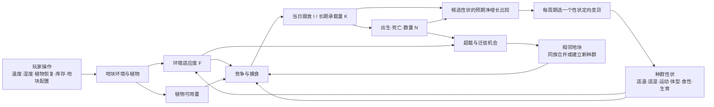

# 生物模拟系统策划文档

> **版本说明：**本文按当时已有代码记录模拟基线。V4.1 的水域共享资源、生态位迁徙、经济、生态仓和事件规则以《游戏策划案v4.1.docx》为准；两者差异是待接入工作，不表示 V4.1 规则已在代码运行。

> **当前实现说明** · 依据 `SimulationController`、`FoodWeb`、`BlockInfo`、`PopulationData` 与数值模拟器源码整理。本文描述已经运行的规则；「调参」是编辑器测试入口，未预设为正式游戏的玩家界面。

## 01 · 一页看懂

**一句话规则：**玩家改变地块环境和资源，种群每天争夺能量、出生或死亡；环境压力出现时，种群定期只朝一个最明显的方向改变性状；开启双地块模式后，还可能迁往相邻地块。



| 看见的现象 | 最直接的原因 | 玩家在模拟器中的入口 |
|:--|:--|:--|
| 某种群适应度下降 | 环境温湿度离它的适宜值更远 | 调温度、湿度 |
| 植食种群长期容量下降 | 每日植物恢复减少，或竞争者抢走份额 | 调每日恢复量、群落组成 |
| 今天没吃饱、死亡增多 | 实际食物不足；现存植物或猎物不足 | 调植物库存、恢复量、猎物数量 |
| 捕食者增减 | 猎物数量、猎物持续生产、捕猎效率改变 | 调群落与环境；观察猎物变化 |
| 性状改变 | 变异评估期存在足够强的环境或生态压力 | 调环境；测试时可调间隔、步长、选择强度 |
| 种群迁往另一地块 | 邻地更适宜，或本地超载，且目的地有空间 | 开启双地块迁徙；调两地环境与海拔 |

---

## 02 · 对象、指标与玩家能改什么

### 地块：外部条件

| 指标 | 范围 / 含义 | 越高会怎样 | 当前输入方式 |
|:--|:--|:--|:--|
| **温度** `temperature` | 0–100；与种群适温比较 | 靠近适温时适应度上升；越过适温后下降 | 运行中应用环境修改 |
| **湿度** `humidity` | 0–100；与种群适湿比较 | 同上，方向取决于当前种群适湿 | 运行中应用环境修改 |
| **植物库存** `plantBiomass` | 当前尚存的植物量，0 至库存上限 | 当日可吃的植物通常更多；不直接提高长期承载量 | 可在运行中应用 |
| **植物库存上限** `maxPlantBiomass` | 地块最多储存的植物量 | 允许更多库存；也限制计入长期容量的每日恢复量 | 可在运行中应用 |
| **每日恢复量** `habitatRecovery` | 低库存时的最大日恢复量，非负 | 植物潜在生长和植食者长期承载量上升 | 运行中应用环境修改 |
| **海拔** `elevation` | 0、1、2 | 只影响相邻地块迁徙通行，不影响适应度 | 可在运行中应用；双地块更有意义 |
| **相邻地块** `Neighbors` | 地块间连接 | 决定自动迁徙候选地 | 场景连接；测试器双地块相互连接 |
| **群落** `community` | 地块内所有种群 | 决定竞争者、猎物和捕食者 | 添加/删除/应用群落配置 |

**每日植物账本**：设 `B=库存上限`、`S=旧库存`、`R=每日恢复量`。`生长 = min(B−S, R × clamp01((B−S)/(0.6B)))`，`新库存 = S + 生长 − 当日摄食`。库存不超过 `40%B` 时，植物按最大恢复量生长；超过后逐渐减速。`B=100000`、`R=1000` 时，约 190 只体型 5、运动 10 的食草者可在约 4 万库存附近与每日生长平衡，而无需降低其 `K`。没有新增植物状态变量。

### 种群：会随模拟改变的个体属性

| 指标 | 范围 | 直接关系 | 变异方向 |
|:--|:--|:--|:--|
| **数量** `speciesAmount` | 非负整数 | 出生增加；捕食、密度、超载、饥饿死亡减少；迁徙改变地块分布 | 数量本身不作为性状变异 |
| **适温** `fitTemperature` | 0–100 | 越靠近地块温度，适应度越高 | 朝环境温度靠近 |
| **适湿** `fitHumidity` | 0–100 | 越靠近地块湿度，适应度越高 | 朝环境湿度靠近 |
| **运动能力** `movementAbility` | 0–100 | 提高觅食或捕获机会；高运动能耗加速增加 | 存在捕食关系时，按预期净增长决定升降 |
| **体型** `size` | 1–100 | 决定食草赛道、猎物能量、捕获机会和个体能耗 | 同赛道弱势者可缓慢朝空赛道转变 |
| **食性等级** `trophicLevel` | 0 / 1 / 2 | 0 吃植物，1 吃 0，2 吃 1 | 可手动修改；不再把整个种群自动改换食性 |
| **生育能力** `fertility` | 0–100 | 提高基础出生率；超过 80 后增加能耗 | 与运动等性状比较预期净增长，可能升降 |
| **海陆空生态位** `habitatNiche` | 数据中保留 0–100 | 当前不参与环境适应、觅食、迁徙或变异 | 当前不变异 |

物种资产 `SpeciesData` **提供初始食性等级，也作为同族判定依据**；食性此后可在模拟器中手动调整，其他性状仍可独立演化。若未指定物种资产，模拟器用种群的**同名标识**判断是否同族；名称不同，即使食性和性状相同也不会自动合并。迁入已有同族时，数量相加，性状按迁入前各自数量加权平均，未满整数的性状余量也计入平均。

### 结果指标：系统算出来的数

| 显示或内部指标 | 读法 | 主要受什么控制 |
|:--|:--|:--|
| **环境适应度** `environmentalFitness` | 0–100；温湿度匹配程度 | 地块温湿度、种群适温适湿 |
| **个体每日能耗** `energyNeed` | 每只每天需要的能量 | 体型、运动能力、高生育能力 |
| **当日实际取得能量** `allocatedBiomass` | 植物或猎物能量；捕食者可用旧储备 | 食物存量、竞争、捕获效率、储备 |
| **长期承载量 K** `carryingCapacity` | 当前食物的**可持续日供给**大致能养活多少只 | 每日植物恢复；猎物可持续产量；竞争份额 |
| **实际摄食率** | `当日取得能量 ÷ 当天需求`，最多记为 1 | 当天实际食物；按不同结算阶段使用不同的数量作分母 |
| **长期供给比 K/N₀** | 承载量相对**捕食前数量**的比例 | 判断长期缺口、超载、部分变异条件 |
| **今日出生 / 死亡** | 实际整数个体数 | 生育、适应度、摄食、密度、超载、捕食 |
| **捕食者储备** `energyReserve` | 吃下整只猎物后未用完的能量 | 捕猎获得能量减今日需求，最多存 10 天 |

> **读图关键：**“今天吃饱”与“长期养得起”是两件事。植物库存很高时，今天可能吃饱；若每日恢复很低，`K` 仍然低，种群随后会因密度与超载压力减少。

---

## 03 · 每个模拟日按什么顺序运行

1. **植物恢复**：按库存距离上限的比例恢复，库存接近上限时生长减慢。
2. **计算适应与能耗**：逐种群算温湿度适应度、个体每日能耗，记录捕食前数量 `N₀`。
3. **分植物**：仅食性 0 级的种群竞争植物；得出当日摄食和长期承载量。
4. **逐级捕食**：1 级吃 0 级、2 级吃 1 级；当天猎物死亡从其数量中扣除。
5. **结算人口**：按实际摄食、长期承载量、适应度计算出生与其他死亡；更新数量与储备。
6. **评估定向变异**：到期的种群试算各性状增减后的预期净增长；所有选择先确定，再一起应用。
7. **迁徙**：若启用且到达迁徙日期，比较邻地，决定是否迁出与迁往哪里。

游戏运行时 `SimulationTime` 默认 **5 秒 = 1 模拟日**，可暂停、正常或 2 倍速。编辑器数值模拟器有独立的“每模拟日秒数”、`Start / Pause / Speed / Restart / Next Day` 控件。

---

## 04 · 核心计算：用最少公式理解结果

下文用 `N₀` 表示当天**捕食前**数量，`H` 表示被捕数量，`N=N₀−H`；`F` 表示适应度（0–1）；`E` 是每只每日能耗；`K` 是长期承载量。出生死亡与摄食率以 `N₀` 计算，捕食死亡单独计入。`clamp01(x)` 表示把 `x` 限定在 0–1。

### 4.1 温湿度 → 适应度

```text
F = clamp01(1 − (|环境温度 − 适温| + |环境湿度 − 适湿|) / 90)
显示值 = round(F × 100)
```

- 温湿度都刚好匹配：`F = 1`；两项偏差相加达到 90：`F = 0`。
- **适温不是“越高越好”**；它是目标位置。环境比目标热，适温应提高；环境比目标冷，适温应降低。适湿同理。
- 适应度越高，种群分食物的权重、出生数、猎物可持续产量通常越高。

### 4.2 体型、运动、生育 → 能耗与觅食

```text
高速额外能耗 = 0.00001 × max(0, 运动能力−50)^3
高生育额外能耗 = 0.0002 × max(0, 生育能力−80)^2
极端性状额外能耗 = 0.02 × [max(0, 运动能力−90)^3 + max(0, 生育能力−90)^3]
小体型额外能耗 = 2 × max(0, 5−体型)^2
E = max(1, 体型 + 0.01 × 运动能力 × (1 + 运动能力/40)
           + 高速额外能耗 + 高生育额外能耗 + 极端性状额外能耗 + 小体型额外能耗)
普通觅食效率 = 0.75 + 0.0025 × 运动能力       （运动 0→100 时为 0.75→1）
捕获指标 = clamp(1 + (捕食者运动 − 猎物运动)/40
                  + (捕食者体型 − 猎物体型)/80, 0.5, 2)
若猎物为 0 级：处理能力 = min(1, 捕食者体型/10)^2；否则处理能力 = 1
捕获机会 = 捕获指标 × 处理能力 / 2
每只被捕猎物提供的能量 = 猎物体型 × 15 × 0.8
```

**权衡：**运动、体型提高会帮助争食或捕猎，但也更费能量；体型低于 5 时额外能耗增加，一级捕食者低于体型 10 时处理猎物的能力下降。运动超过 50、生育超过 80 后能耗加快增长，二者超过 90 后成本进一步提高。捕获机会随体型差连续变化，但体型达到处理猎物所需的大小后，处理能力不再提高。运动改变捕获机会，不改变猎物被吃后的能量。运动能力不改变每天可跨越的地块数。

### 4.3 植物竞争 → 植食者 K 与今日摄食

```text
R = min(每日恢复量, 植物库存上限)
可计入容量的食物 = min(当日可取得的草, min(草库存, R) × 最高适应度)
小体型赛道：size < 8；大体型赛道：size ≥ 8
各赛道专属额度 = 可计入容量的食物 × 45%
公共额度 = 可计入容量的食物 × 10% + 无人使用的专属额度
同赛道权重 Wᵢ = Eᵢ × Nᵢ × Fᵢ × 觅食效率ᵢ
植食种群 Kᵢ = 其专属额度份额与公共额度份额之和 / Eᵢ
```

草库存只供当日摄食，不能重复计入长期承载量。`K` 使用每日最大恢复潜力 `R`，实际植物生长仍随库存变满而减慢。两条赛道来自已有 `size`，没有新增物种属性或独立植物库存。同赛道按原竞争权重争夺；分属两条赛道时只在公共额度竞争。

当日实际分食也按 45% / 45% / 10% 额度进行；吃饱或没有对应种群时，剩余草可进入公共额度。每轮按各群**尚未满足的需求 × 适应度 × 觅食效率**分配，吃饱的退出，剩余资源继续分给其他种群。

### 4.4 逐级捕食 → 捕食者 K 与今日摄食

```text
1 级每天的期望捕食上限 = 猎物数量 × 8% × 捕食方综合效率 × 捕获机会
2 级将式中的 8% 换为 10%
可持续捕食量 = max(0, 猎物预计出生 − 猎物预计死亡 + 50% × 猎物预计密度死亡)
捕食者可持续食物 = min(期望捕食量, 可持续捕食量) × 每只猎物能量
捕食者 K = 分到的可持续食物能量 ÷ 捕食者个体能耗
```

多个同级捕食者先统一计算需求，再按“需求 × 觅食效率 × 适应度”竞争猎物能量。捕食者**先花已有能量储备，再捕猎**；整只猎物的剩余能量存入储备，上限约为该种群 10 天的需求。实际整数捕获用期望值的小数部分随机进位，使猎物少于十几只时仍有低频捕获机会。`8%`、`10%` 是默认值，可在种群模拟器测试窗口分别调整；`0.8` 仍为固定数值。调整捕食比例后，预测承载量、变异试算和迁徙目标估计也使用相同设置。

### 4.5 摄食、承载量 → 出生与死亡

```text
r = 生育能力 / 100 × 繁殖系数                   （默认繁殖系数 0.05）
I = clamp01(当日取得能量 / (捕食前数量 N₀ × E))
预计出生 B = 若 K > 0，则 N₀ × r × F × I；否则 0
密度死亡 D密 = 若 K > 0，则 B × N₀ / K；否则 0
超载死亡 D超 = N₀ × 超载衰退上限 × max(0, 1 − K / N₀)
饥饿死亡 D饿 = N₀ × 最大饥饿死亡率 × (1 − I)
自然死亡 = D密 + D超 + D饿 − 50% × min(被捕数量, D密)
下一数量 = max(0, N₀ − 被捕数量 + 整数出生 − 整数自然死亡)
```

默认 `超载衰退上限 = 0.1`，`最大饥饿死亡率 = 0.6`；捕食者因整只猎物带来的随机断粮，饥饿死亡率按这个值的一半计算。出生和自然死亡分别累计小数余量，凑足一只才结算。`N₀ ≈ K` 且吃饱时，出生与密度死亡相抵；部分捕杀替代原本会发生的密度死亡，使捕食压力不会简单叠加在原死亡率之上。

**两个常见误读**：

- `K/N₀` 是基于当前可持续供给的**资源支撑比**；代码把它记录为 `energySatisfactionToday`，它可以大于 1，并非当日实际吃饱百分比。
- `actualEnergySatisfactionToday` 即上文的 `I`，用 `N₀` 作分母，用于变异与出生死亡判断。当天被捕的猎物单独扣除。

---

## 05 · 变异：比较预期净增长

**默认节奏**：变异开启；每 7 天评估一次；基础步长 2；选择强度 1。环境温湿度或每日恢复量修改后，下一模拟日会提前评估。测试窗口每天实时显示各存活种群当前的预期进化方向。

每轮固定当前的种群数量、环境和食物关系，分别试算适温、适湿、生育；有相邻营养级时还试算运动和体型的小幅提高与降低：

```text
G(候选性状) = 预计出生 − 预计自然死亡 − 预计被捕食
候选收益 = G(候选性状) − G(当前性状)
评分单位 = max(0.01, 当前数量 × 繁殖系数 × 变异步长 / 100)
评分 = min(1, 候选收益 / 评分单位 × 选择强度)
```

试算复用现有的 `K`、出生、密度死亡、饥饿死亡及捕食机会公式；捕食试算用连续期望值和当天固定的捕食努力，不消耗随机数。候选体型会重新计算猎物能量。选收益最高且评分至少 `0.15` 的一个方向。实际性状变化为 `方向 × 变异步长 × 性状倍率 × 评分`；生育倍率为 `0.5`，普通体型变异为 `0.1`，其他为 `1`。小数变化累计到原有余量中。所有种群先决定方向，再同时应用。

- **适温、适湿**：向环境靠近通常提高适应度与预期出生；反向候选收益为负时不会选中。
- **运动**：只在相邻营养级存在捕食关系时试算。跑得更快可能少被捕或更易捕获，也会消耗更多能量；过快时降低运动可能更有利。
- **生育**：提高会增加出生，超过 80 后能耗也增加；当食物、密度或捕食使成本超过新增出生时停止提高，也可能降低。
- **体型**：单食草者没有捕食关系时，不参与普通变异；有捕食关系时按同一套预期净增长评分，可增可减。体型低于 5 的生理成本、捕食者低于 10 的处理成本与较大体型的日常能耗形成权衡。换赛道沿用原步幅：同赛道少数种群若连续下降、另一赛道仍可维持至少当前数量的一半，会试算体型 6 或 10 的长期收益，并保留 `0.38` 的提前换赛道评分下限，允许跨越 `size=8` 前的暂时不利阶段。
- **食性等级**：不自动变异，仍可在测试器中手动调整。

这是种群平均性状的趋势试算，没有新增个体、基因或物种属性。换赛道评分下限是游戏规则；它使弱势种群能在约 500 天内发生可见的生态位变化。

---

## 06 · 迁徙：双地块中的空间反馈

迁徙在编辑器测试器中默认关闭；开启后使用左右两个相邻地块。自动迁徙默认每 **7 天**检查一次。玩家还可手动点击迁出按钮；手动迁出跳过概率判断，但仍受数量与冷却限制。

| 步骤 | 当前规则 |
|:--|:--|
| 可走哪里 | 只考虑相邻地块；海拔差 0 可通行系数 1，差 1 为 0.5，差 ≥2 不通行 |
| 目标要有空间 | 目的地容量校正 `C = clamp01(1 − 目的地同物种数量 / 目标容量)`；`C = 0` 时不迁入 |
| 正常迁徙 | 优先选**适应度严格更高**的邻地；可迁入已有同族并合并；概率 `适应度提升 × 地形系数 × N/(N+规模系数) × C` |
| 超载迁徙 | 若正常迁徙未发生，只选**尚无同族**且有空间的邻地，用于建立新种群；压力 `P = clamp01((N/K − 超载阈值)/(1−超载阈值))`，`K≤0` 时为 1；概率 `P × 基础超载概率 × 地形系数 × C` |
| 迁出多少 | 正常按 `round(N × 适应度提升)`；超载按 `round(N × P × 超载迁出比例)`；最后限制为 **至少 10、至多 100**，否则不迁 |
| 冷却 | 迁出与迁入种群都要等待设置的冷却天数，默认 7 天 |
| 防止往返 | 种群记住上次迁入的来源地；环境未重新调整前，不会**自动迁回**该地。玩家修改地块环境时解除此限制；手动迁徙仍可在冷却结束后操作 |
| 到达之后 | 目标地没有同族则新建种群；正常或手动迁徙遇到已有同族时，数量相加、性状连同小数余量按数量加权平均；储备与出生死亡小数余量也随个体拆分或合并 |

默认迁徙参数：`规模系数 100`、`超载阈值 0.8`、`基础超载概率 0.5`、`超载迁出比例 0.2`。目标容量对已有同物种直接采用其最近计算的 `K`；对尚无该物种的地块使用当前食物机会与适应度进行估计。**这属于迁徙选择用的估计值**，迁入后真实 `K` 要等下一天重新分配食物才能确定。

当前 `waterCoverage`、海陆空生态位不参与迁徙判断；海拔也不改变日常摄食或出生。

---

## 07 · 调参地图：想看到什么，先改哪个值

| 目标现象 | 优先改玩家可见的环境 / 配置 | 若要调规则灵敏度，再改这些测试参数 | 观察什么 |
|:--|:--|:--|:--|
| 适温或适湿明显朝环境靠近 | 改温度或湿度，制造单一差异 | `选择强度`↑、`变异间隔`↓、`变异步长`↑ | 目标性状是否朝环境移动，其他性状是否保持 |
| 环境适宜时长期稳定 | 温湿匹配；每日恢复量与数量、能耗相称 | `繁殖系数`、`超载衰退上限`、`最大饥饿死亡率` | `N` 是否靠近 `K`，库存是否不持续枯竭 |
| 形成同赛道优势种 | 两个 0 级种群的体型都低于 8，给一方明显的温湿和运动优势 | 通常先不改规则参数 | 弱势种是否灭绝，强势种与植物库存是否稳定 |
| 形成双赛道共存 | 两个 0 级种群起初都小于 8，给弱势种可存活的过渡期 | 变异间隔和步长可改变换赛道速度 | 弱势种体型是否跨过 8，两种数量是否各自趋于 `K` |
| 看见捕食关系 | 加入 0 级猎物与 1 级捕食者，保证猎物可持续增长 | 需要时调繁殖系数与饥饿死亡率 | 猎物被捕死亡、捕食者 K 与能量储备 |
| 让运动或体型朝对手演化 | 放相邻食性等级、制造速度或体型差；同时保证能量足够 | 步长与选择强度决定变化速度 | 是否只改得分最高的一个性状；缺食时是否拒绝增大 |
| 手动改食性 | 在群落配置或当前状态修改营养级 | 无自动食性变异 | 下一日是否按新营养级取食 |
| 看到迁徙 | 开启双地块，制造适应度差或本地超载，保持目的地有空间 | `迁徙间隔`↓、`超载阈值`↓、`基础超载概率`↑ | 迁出数量、两地总数量、冷却、性状合并 |

**优先级建议**：先调环境温湿度与每日恢复量，观察生存；再调种群数量、食性与对手差异，观察竞争和捕食；最后调变异、死亡和迁徙的速度参数。这样每次测试更容易判断是哪一个输入产生了变化。

### 调试时应记住的边界

- 规则只有 **三级食物链**；0 吃植物，1 吃 0，2 吃 1。没有跨级捕食。
- 单地块模式不发生自动迁徙；双地块模式默认也要先**启用迁徙**。
- 变异不是概率抽取：有合格压力就选最高分性状；没有合格压力就不变。
- `habitatNiche` 和 `waterCoverage` 目前只是保留数据，**不应作为已实现的玩法杠杆**。
- 测试器中的“固定关键变量”是开发调参入口。运行中“应用群落修改”会保留已存在种群的当前数量，编辑框的初始数量只用于新加入的种群；需要重设全部初值时点击 Restart。

---

## 08 · 快速对照源码

`Assets/Scripts/Simulation` 根目录保留六个脚本。游戏代码调用 `SimulationController` 的公开方法；`FoodWeb`、`PopulationTransfer` 和水域拓扑类型是规则实现，不需要额外挂载。

| 内容 | 源码位置 |
|:--|:--|
| 每日执行顺序与种群结算 | `Assets/Scripts/Simulation/SimulationController.cs` |
| 植物分配与捕食 | `Assets/Scripts/Simulation/SimulationController.FoodWeb.cs` |
| 性状变异、预测与预设物种演化 | `Assets/Scripts/Simulation/SimulationController.Evolution.cs` |
| 陆地迁徙、海陆空生态位与种群转移 | `Assets/Scripts/Simulation/SimulationController.Migration.cs` |
| 河岸、邻接和水域连通 | `Assets/Scripts/Simulation/HabitatTopology.cs` |
| 游戏模拟日时钟 | `Assets/Scripts/Simulation/SimulationTime.cs` |
| 地块输入、植物库存、群落、邻居 | `Assets/Scripts/BioData/BlockInfo.cs` |
| 种群性状、结果指标和小数余量 | `Assets/Scripts/BioData/PopulationData.cs` |
| 物种初始食性 | `Assets/Scripts/BioData/SpeciesData.cs` |
| 单/双地块模拟器输入与显示 | `Assets/Scripts/Simulation/Editor/PopulationSimulatorWindow.cs`、`PopulationSimulatorWindow.Migration.cs` |
