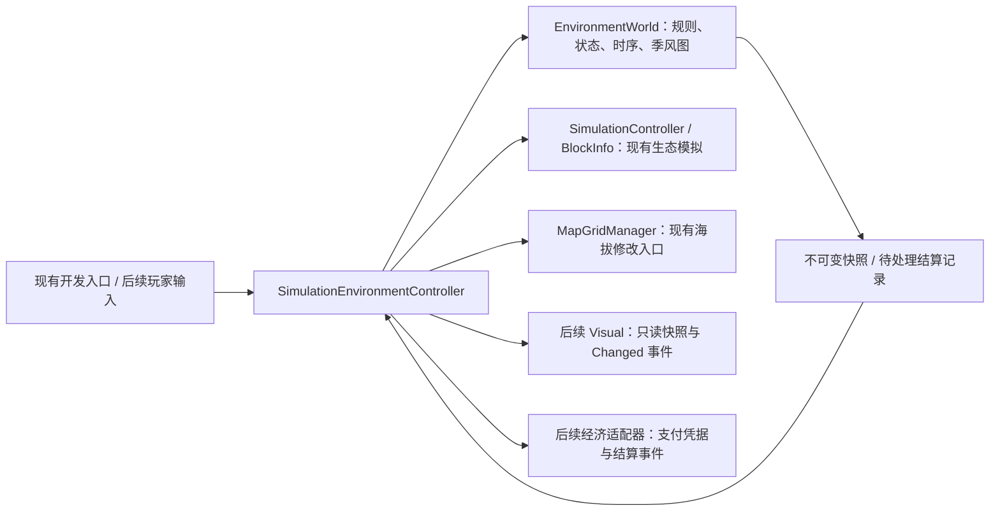

# 环境干预规则与接入说明

> 此文档的第 4–6 节保留旧版时序，供历史接入对照。当前玩家科技操作以
> [TECHNOLOGY-OPERATIONS.md](TECHNOLOGY-OPERATIONS.md) 为准。

> **版本说明：**本文记录已有环境模块的实现基线。V4.1 新增的生物能价格、水域重组、玩家操作与事件先后顺序，以《游戏策划案v4.1.docx》为当前策划口径；下文的“后续经济适配器”描述代码状态，并非价格待定。

本文件记录本次讨论确认的实现规则。数值规则统一放在 `EnvironmentRules`；八个地形资产同步填写相同的部署数值。资产 GUID 和旧 `BiomeType` 序列化编号保留。运行时地形以环境模型快照中的 `Terrain` 为准。

## 1. MVC 分工



| 层 | 文件 | 职责 |
|---|---|---|
| Model | `EnvironmentRules.cs` | 默认值、唯一地形分类、边界、强度、库存百分比规则 |
| Model | `EnvironmentState.cs` | 内部状态和不可变快照、拓扑节点、支付/结算数据契约 |
| Model | `EnvironmentWorld.cs` | 操作替换、每日时间推进、地形转型、季风覆盖和取消 |
| Controller | `SimulationEnvironmentController.cs` | 预览、提交、地图/生态接入、读取和事件发布 |
| 兼容入口 | `SimulationInterventionController.cs` | 现有编辑器调用适配；删除旧的逐日重复加值逻辑 |
| 后续 View | 本次未实现 | 通过 Controller 读取数据；渲染不能回写模型 |
| 后续经济适配器 | 本次未实现 | 价格、余额、扣款、退款执行由后续系统负责 |

纯模型不引用 Unity，也不持有地块对象、Renderer 或账户。地图同步通过 `BlockGraphSynchronized` 接入；每日环境变化通过 `OnBeforeDaySimulated` 在生态结算之前提交。一天结束后发布包含最新库存的 `Changed` 快照，避免显示前一天的库存。

保留现有地图生成、边缘、旋转、移动和导航代码；海拔变化调用原有 `TrySetTileHeight`。没有新增地形渲染或季风特效。现有开发入口仅做必要的参数、提示和接口适配。

## 2. 全局边界与部署默认值

| 数据 | 规则 |
|---|---|
| 海拔 | 0、1、2 |
| 温度、湿度 | 0–100；目标在操作提交时裁剪 |
| 每日植被增量 | 0–150,000；分类使用潜在每日恢复量 `habitatRecovery` |
| 植被库存上限 | 固定 1,000,000 |
| 新部署库存 | 等于该地形默认每日增量 |
| 无外部操作 | 使用当前地形默认值；转型后的无操作属性在25天内转向新默认 |
| 实际当日植物生长 | 保留既有生态增长/消耗算法；不同于分类使用的潜在增量 |
| 分类数值精度 | 模型保留线性变化的小数；生态数值与分类统一四舍五入（中点向远离零方向） |

| 地形 | 默认海拔/定义 | 默认温度/定义 | 默认湿度/定义 | 默认每日增量/定义 | 部署库存 | 连接类型（预留） |
|---|---|---|---|---|---|---|
| 森林 | 1 / 中 | 58 / 中 | 50 / 中 | 125,000 / 偏多 | 125,000 | Grass |
| 雨林 | 0 / 低 | 75 / 偏热 | 83 / 很湿 | 125,000 / 偏多 | 125,000 | Grass |
| 草原 | 0 / 低 | 68 / 偏热 | 68 / 偏湿 | 100,000 / 中 | 100,000 | Grass |
| 荒漠 | 0 / 低 | 68 / 偏热 | 17 / 很干 | 50,000 / 少 | 50,000 | Sand |
| 苔原 | 1 / 中 | 17 / 很冷 | 68 / 偏湿 | 75,000 / 偏少 | 75,000 | Grass |
| 高山 | 2 / 高 | 50 / 中 | 50 / 中 | 100,000 / 中 | 100,000 | Grass |
| 雪山 | 2 / 高 | 17 / 很冷 | 50 / 中 | 50,000 / 少 | 50,000 | Rock |
| 火山 | 2 / 高 | 83 / 很热 | 50 / 中 | 50,000 / 少 | 50,000 | Rock |

默认海拔只在部署时使用。转型不改变实际海拔、不重建植物库存。雪山、火山的默认增量均属于“少”；运行时只有增量不超过50,000的组合能够归入这两类。

## 3. 唯一分类表

确认后的增量分档：**少：0–50,000；中档：>50,000–100,000；多档：>100,000–150,000**。这三个分类档与默认值的五级文字描述分开使用。“任意”始终指合法范围。

下面各行彼此排斥，覆盖全部合法组合；没有过渡地块。中海拔温和高山分支已加入，“热、湿度适中、增量多”归入雨林。

| 地形 | 海拔 | 温度 | 湿度 | 每日增量 |
|---|---|---|---|---|
| 荒漠 | 0 | 0–14 | 任意 | 任意 |
| 荒漠 | 0 | 15–34 | 0–34 | 任意 |
| 荒漠 | 0–1 | 35–100 | 0–34 | ≤50,000 |
| 森林 | 0 | 15–34 | 35–100 | 任意 |
| 森林 | 1 | 0–34 | 35–100 | >100,000 |
| 森林 | 0–1 | 35–49 | 35–100 | >100,000 |
| 森林 | 0–1 | 50–65 | 35–65 | >100,000 |
| 草原 | 0–1 | 35–100 | 0–34 | >50,000 |
| 草原 | 0 | 35–100 | 35–100 | ≤100,000 |
| 草原 | 1 | 35–65 | 35–65 | ≤50,000 |
| 草原 | 1 | 35–65 | 66–100 | ≤100,000 |
| 草原 | 1 | 66–100 | 35–100 | ≤100,000 |
| 雨林 | 0–1 | 50–100 | 66–100 | >100,000 |
| 雨林 | 0–1 | 66–100 | 35–65 | >100,000 |
| 高山 | 1 | 0–34 | 0–34 | 任意 |
| 高山 | 1 | 35–65 | 35–65 | >50,000且≤100,000 |
| 高山 | 2 | 0–34 | 0–34 | >50,000 |
| 高山 | 2 | 0–34 | 35–100 | >100,000 |
| 高山 | 2 | 35–65 | 任意 | 任意 |
| 高山 | 2 | 66–100 | 任意 | >50,000 |
| 苔原 | 1 | 0–34 | 35–100 | ≤100,000 |
| 苔原 | 2 | 0–34 | 35–100 | >50,000且≤100,000 |
| 雪山 | 2 | 0–34 | 任意 | ≤50,000 |
| 火山 | 2 | 66–100 | 任意 | ≤50,000 |

每次数值或海拔变化后，根据四个实际参数重新分类。已提交的操作目标不因中途转型重新加偏移；没有操作持有的属性则转向新默认。增量操作在瞬间转型后捕获新类型默认增量作为本次100天恢复目标。

## 4. 操作与时序

| 操作 | 强度 | 目标基数 | 生效/维持/退出 | 替换规则 |
|---|---|---|---|---|
| 单格温度 | ±25 / ±50 | 提交时当前地形默认温度 | 25天进入、维持100天、25天退出 | 所有阶段均可被同属性新操作替换；从当前值重新进入 |
| 单格湿度 | ±25 / ±50 | 提交时当前地形默认湿度 | 同上 | 同上；与温度各自独立 |
| 季风 | 温度和湿度各自选±20 / ±40 | 每格进入覆盖区时的当前地形默认值 | 25天进入、永久维持、25天退出 | 同发源点重新部署替换旧季风；其他新变化可抢断过渡 |
| 植被增量 | ±25,000 / ±50,000 | 当前地形默认增量 | 立即生效，100天线性恢复 | 可随时替换；恢复目标取瞬间分类后地形默认增量 |
| 增加库存 | +25% / +50% | 固定库存上限 | 立即增加250,000 / 500,000，裁剪到上限 | 一次性，不安排恢复 |
| 减少库存 | −25% / −50% | 提交时现有库存 | 立即扣除对应比例 | 一次性，不安排恢复 |
| 海拔 | ±1 | 当前实际海拔 | 立即生效；越过0–2时拒绝 | 一次性，不安排恢复 |

单格时序以提交日为第0天：第25天到目标并开始维持；第125天开始退出；第150天退出完成。主动撤销从当日实际值退出25天。新命令不叠加旧命令；变更后的目标均由当前默认加新强度计算。

温湿度通常以25天线性过渡，裁剪到边界时仍完整使用25天，因此每天变化可能小于1/2。植物增量、植物库存、海拔保留上表的例外。库存操作不会停掉生态自然增长和摄食。

## 5. 单格与季风的优先级

| 状态 | 季风归属 | 温湿度数值 | 预留视觉状态 |
|---|---|---|---|
| 只有季风 | 保留 | 使用季风目标 | `MonsoonApplied = true` |
| 任意单格温度/湿度进入或维持 | 保留 | 两项季风效果都被抑制；有单格命令的属性按其目标，无命令的属性转向默认 | `HasMonsoon = true`，`MonsoonApplied = false` |
| 单格退出且另一项仍进入/维持 | 保留 | 退出属性向默认恢复 | 仍抑制季风 |
| 最后一项单格退出，季风仍存在 | 保留 | 在退出25天内直接转向季风目标，不额外绕经默认 | 单格退出完成前仍抑制季风标志 |
| 单格退出期间季风被取消/更换 | 按新覆盖图更新 | 从当前值重新过渡25天，不继续使用失效目标 | 由快照状态决定 |
| 只有植物或海拔操作 | 按拓扑规则判断 | 植物操作不抑制季风；海拔修改可能触发季风重算/取消 | 不伪造单格温湿度标志 |

## 6. 季风覆盖与结算

| 情况 | 行为 | 退款数据 |
|---|---|---|
| 部署 | 发源点必须海拔0或1；四邻接、相同海拔的连通分量（含自身）成为覆盖区 | 本次未实现扣费；可绑定实际支付凭据 |
| 任一现存发源点海拔或物理邻居列表变化/被移除 | 所有季风全局取消 | 0 |
| 非发源点海拔或物理邻居列表变化 | 同步重算所有发源点覆盖图 | 无冲突时不产生退款 |
| 新增覆盖成员 | 从该格当前值25天进入 | 无 |
| 离开覆盖区成员 | 从当前值25天退出 | 无 |
| 覆盖成员保持不变 | 继续原时间线，不重新进入 | 无 |
| 任意覆盖重叠 | 先查出整张冲突图，再撤销全部参与冲突的季风 | 各自实际支付金额的100% |
| 主动取消 | 相应季风撤销，成员退出 | 0 |
| 同发源点替换 | 旧季风退出记录为Replaced，新季风重新应用 | 旧季风不退费 |

“物理邻居列表”包含不同高度邻居，因此在发源点旁新放置地块也会触发全局撤销。被单格操作抑制的格子依然计入季风覆盖冲突。

`EnvironmentPayment` 保存凭据ID和实际支付金额（允许0）。凭据不可重复绑定。`MonsoonSettlement` 保存季风ID、退出原因、原凭据和应退金额；本模块只产生记录，不增加余额。多季风冲突同时撤销，避免取消顺序导致漏退或保留冲突成员。

## 7. 后续接口用法

从地图模拟组件所在对象读取 `SimulationEnvironmentController`：

```csharp
controller.TryPreview(coordinate, SimulationInterventionKind.Temperature, 25,
    out EnvironmentOperationPreview preview, out string error);
controller.TryApply(coordinate, SimulationInterventionKind.Temperature, 25, out error);
controller.TryCancel(coordinate, EnvironmentAttribute.Temperature, out error);

controller.TryPreviewMonsoon(source, -20, 40, out var area, out error);
controller.TryDeployMonsoon(source, -20, 40, out long monsoonId, out error,
    payment: null); // 后续由可信经济适配器传入实际支付凭据
controller.TryCancelMonsoon(monsoonId, out error);
```

| 接口 | 后续用途 |
|---|---|
| `TryRead` / `ReadAll` | 不可变的实时环境、默认值/定义、实际库存、上限、操作阶段/目标/进度 |
| `Changed` | 提交、地图同步、每日生态结算完成后通知视觉读取快照 |
| `Monsoons` | 发源点、温湿度强度、排序后的不可变覆盖列表 |
| `HasMonsoon` / `MonsoonApplied` | 区分季风归属与当前生效；视觉只按Controller读取结果表现 |
| `TryPreview` | 单格目标、时序、按其他参数保持现值计算的预估类型；不承诺未来完整生态预测 |
| `PendingSettlements` / `SettlementAvailable` | 经济适配器查询和接收应处理结算；晚订阅时查询待处理列表 |
| `AcknowledgeSettlement` | 经济系统幂等完成结算后确认移除待处理项 |
| `IEnvironmentEconomySink` | 预留经济消费契约；暂无实现 |

库存命令使用 `±0.25f / ±0.5f`，不是±25。半径固定0。旧请求的 `durationDays` 只保留序列化兼容性，时序由操作类型决定。原有水陆状态与群落/全局参数开发入口保留。

默认数据为固定游戏规则，不能通过修改资产的旧生态字段创建另一套运行时默认。新场景应配置规范八类预设；旧Grass/Sand/Rock编号分别兼容映射为草原/荒漠/高山。场景建造列表已收敛为八类。

`ResetDay` 仍只重置时钟，不重置生态库存或操作；新模型同步重置日期基准，保留操作年龄。环境模型与支付记录目前均为本次运行内存状态；跨场景/存档持久化属于后续接入工作。

## 8. 验证

纯规则和时序验证：

```powershell
dotnet run --project Tools/EnvironmentAudit/EnvironmentAudit.csproj
dotnet run --project Tools/SimulationAudit/MutationAudit.csproj
dotnet build Assembly-CSharp-Editor.csproj --nologo -v:q
```

环境审计独立按分类表检验全部101×101温湿度、三个海拔和14个增量边界代表值；并验证部署稳定、进入/维持/恢复、抢断、双属性共存、季风抑制、拓扑扩张/脱离、全局撤销、多组重叠和退款、快照只读、库存比例及时间重置。

真实Unity接入验证入口为 `EnvironmentIntegrationAudit.Run`（仅批处理运行）。它在Play模式中读取八个资产并放置地块，验证Controller接入、生态推进、单格/季风互斥、恢复、海拔地图事件、库存保留、支付结算和旧开发入口。只在内存中修改测试场景，不保存场景。

```powershell
# 不加 -quit；审计在Play模式验证完成后自行退出。
Unity.exe -batchmode -nographics -projectPath "项目绝对路径" `
  -executeMethod EnvironmentIntegrationAudit.Run -logFile "Temp/EnvironmentUnityAudit.editor.log"
```

结果写入 `Temp/EnvironmentUnityAudit.result.txt`。视觉表现、账户扣款与退款执行不在本次测试范围。

本次验证结果：纯环境审计857,088项断言通过；原生态审计通过（200组365天压力场景无非法数值）；运行时与编辑器编译0警告、0错误；真实Unity Play模式接入审计通过。
