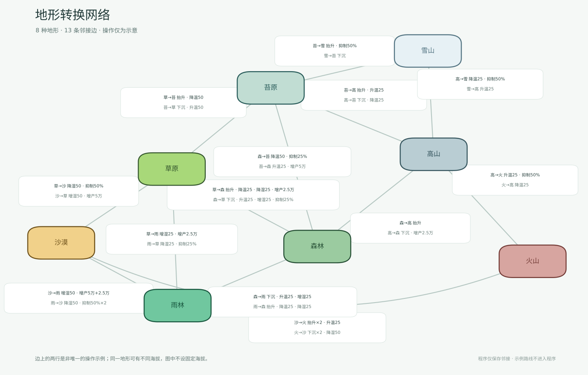
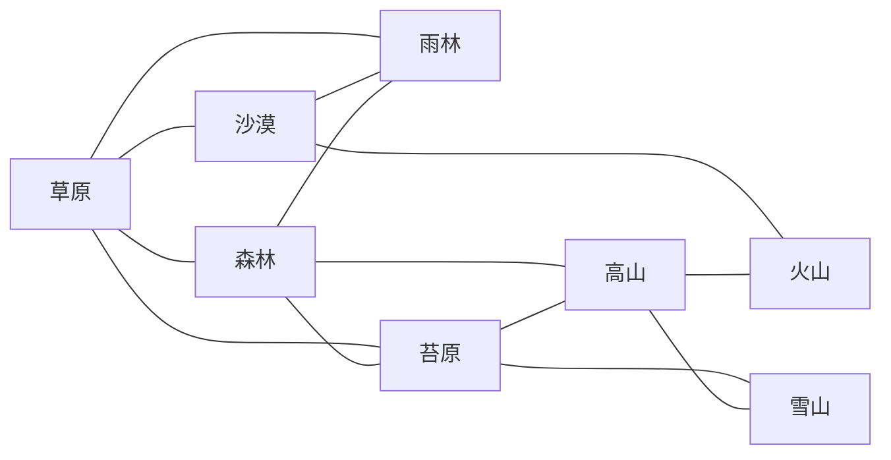

# 地形转换图（目标规则草案）

本图描述下一轮环境规则的**地形类型邻接设计**，不是当前游戏已经支持的操作结果。范围为八种陆地地形；地块的物理四邻接与这里的“地形类型相邻”是两种不同的图。程序只保存邻接关系。图上每个方向的科技操作是讨论时画出的示意方案，既不唯一，也不作为运行时配方或可达性保证。

图中节点只显示地形名称，不显示海拔数值。抬升／下沉仅是示例操作；同一地形可以存在于不同海拔，实际地形仍由地块当时的海拔、温度、湿度和恢复量判定。可放大的 SVG 和便于预览的 PNG 位于本文件旁边，渲染脚本为 `Tools/render_terrain_transition_graph.py`。

## 节点与连通性

| 地形 | 放置预设：海拔 / 温度 / 湿度 / 日恢复量 | 邻居 | 度数 |
| --- | --- | --- | ---: |
| 草原 | 0 / 68 / 68 / 100,000 | 沙漠、森林、雨林、苔原 | 4 |
| 沙漠 | 0 / 68 / 17 / 50,000 | 草原、雨林、火山 | 3 |
| 森林 | 1 / 58 / 50 / 125,000 | 草原、雨林、苔原、高山 | 4 |
| 雨林 | 0 / 75 / 83 / 125,000 | 草原、沙漠、森林 | 3 |
| 苔原 | 1 / 17 / 68 / 75,000 | 草原、森林、高山、雪山 | 4 |
| 高山 | 2 / 50 / 50 / 100,000 | 森林、苔原、雪山、火山 | 4 |
| 雪山 | 2 / 17 / 50 / 50,000 | 苔原、高山 | 2 |
| 火山 | 2 / 83 / 50 / 50,000 | 沙漠、高山 | 2 |

整图连通，共 8 个节点、13 条双向边；每个节点有 2–4 个邻居。表里的海拔只描述当前资产的放置预设，不能作为地形图的边界条件。

## 双向操作示例（不进入程序）

`T` 温度、`H` 湿度、`R` 植物日恢复量、`Z` 海拔。`R×0.5`/`R×0.75` 分别表示 50%/25% 生态抑制。以下仅记录绘图时假设从表中放置预设出发的例子；其他海拔、当前环境和将来的科技规则可能产生不同操作序列。操作次数不是所有状态下的承诺。

| 边 | 正向路线 | 次数 | 反向路线 | 次数 |
| --- | --- | ---: | --- | ---: |
| 草原 ↔ 沙漠 | 草→沙：`H−50`, `R×0.5` | 2 | 沙→草：`H+50`, `R+50k` | 2 |
| 草原 ↔ 森林 | 草→森：`Z+1`, `T−25`, `H−25`, `R+25k` | 4 | 森→草：`Z−1`, `T+25`, `H+25`, `R×0.75` | 4 |
| 草原 ↔ 雨林 | 草→雨：`H+25`, `R+25k` | 2 | 雨→草：`H−25`, `R×0.75` | 2 |
| 草原 ↔ 苔原 | 草→苔：`Z+1`, `T−50` | 2 | 苔→草：`Z−1`, `T+50` | 2 |
| 沙漠 ↔ 雨林 | 沙→雨：`H+50`, `R+50k`, `R+25k` | 3 | 雨→沙：`H−50`, `R×0.5`, `R×0.5` | 3 |
| 沙漠 ↔ 火山 | 沙→火：`Z+1`, `Z+1`, `T+25` | 3 | 火→沙：`Z−1`, `Z−1`, `H−50` | 3 |
| 森林 ↔ 雨林 | 森→雨：`Z−1`, `T+25`, `H+25` | 3 | 雨→森：`Z+1`, `T−25`, `H−25` | 3 |
| 森林 ↔ 苔原 | 森→苔：`T−50`, `R×0.75` | 2 | 苔→森：`T+25`, `R+50k` | 2 |
| 森林 ↔ 高山 | 森→高：`Z+1` | 1 | 高→森：`Z−1`, `R+25k` | 2 |
| 苔原 ↔ 高山 | 苔→高：`Z+1`, `T+25` | 2 | 高→苔：`Z−1`, `T−25` | 2 |
| 苔原 ↔ 雪山 | 苔→雪：`Z+1`, `R×0.5` | 2 | 雪→苔：`Z−1` | 1 |
| 高山 ↔ 雪山 | 高→雪：`T−25`, `R×0.5` | 2 | 雪→高：`T+25` | 1 |
| 高山 ↔ 火山 | 高→火：`T+25`, `R×0.5` | 2 | 火→高：`T−25` | 1 |

## 后续设计待讨论

1. 科技操作如何在同一通道抢断、在不同通道并行，以及操作结束后如何自然恢复。
2. 温湿度如何改变日恢复量，进而影响植物库存和地形；此因果链应以实际环境值计算，避免从当前地形反推并形成循环。
3. 在不同海拔和初始状态下验证邻接设计的可达性；需要用重新确定的科技规则生成路线，不能把本页的示例当作测试标准。

当前 `EnvironmentRules.Classify`、`EnvironmentWorld.TrySetClimate` 与恢复时序仍是旧规则；地形图只提供邻接查询，不限制现有重分类结果。
